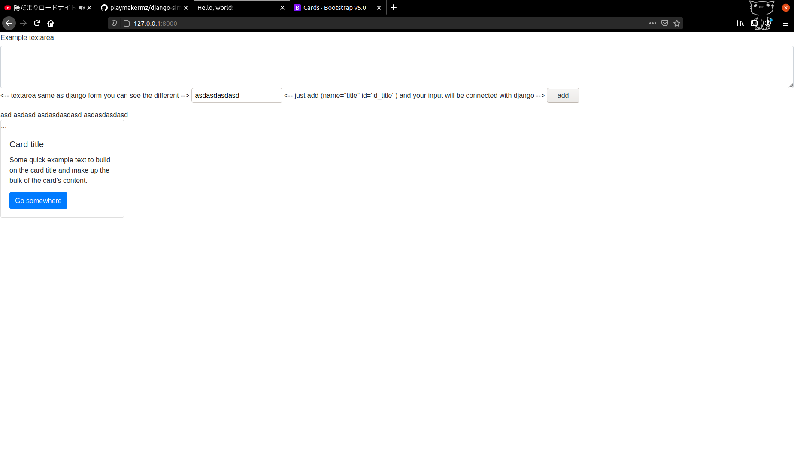

# File_upload
very simple
django file upload, without using django.forms




## Feature
1)show file type

2)show name

3)show size file

***

manual file upload for django
```
python manage.py migrate
python manage.py runserver

```

my note 
<http://batumz.herokuapp.com/wiki/file-upload-django/>
